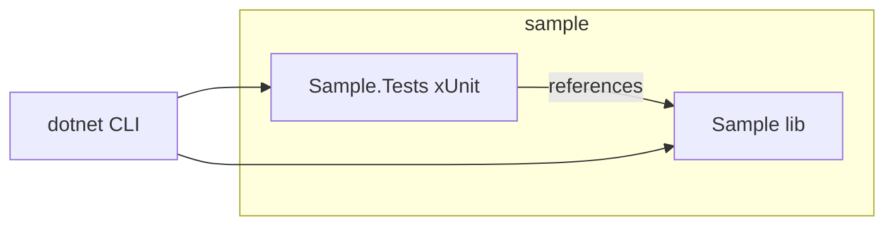
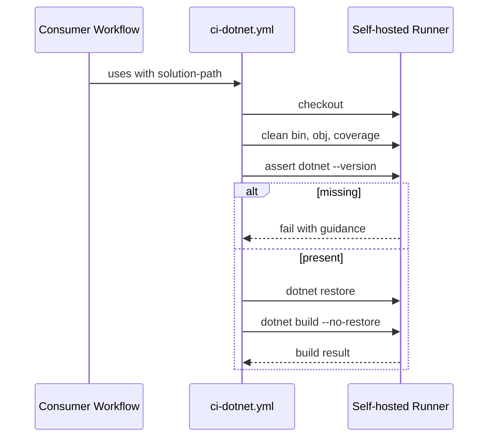
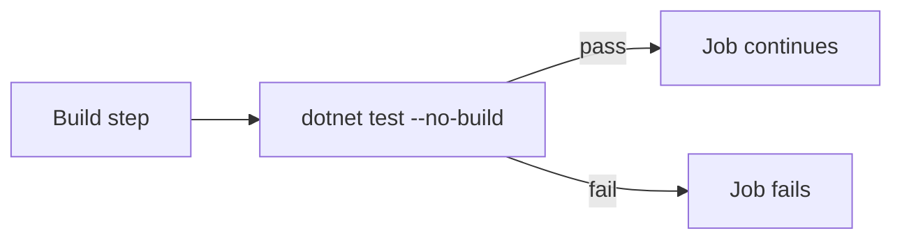
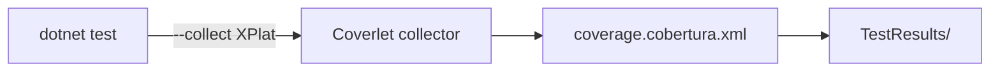
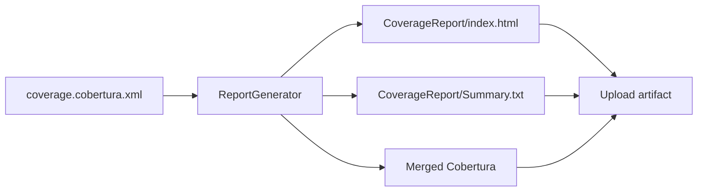
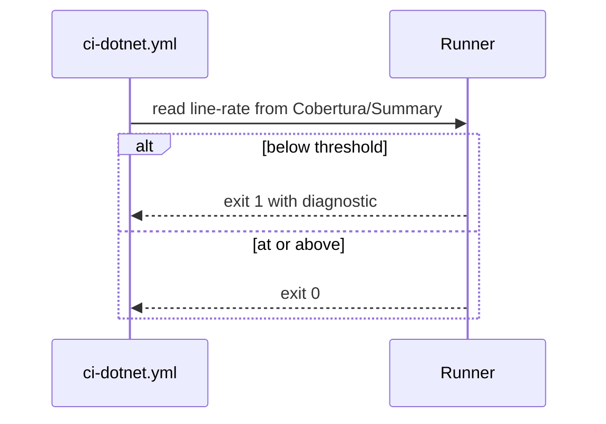
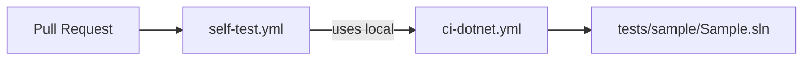

# Plan - Shared .NET CI and Coverage Analysis

See [problem.md](problem.md) for context, scope, constraints, and done
criteria. Each step below is a single commit. Tests for this repository
mean: the reusable workflow is exercised end-to-end against a minimal
in-repo sample .NET project (the "self-test consumer") that lives under
`tests/sample/`. Until that sample exists, earlier steps are validated by
local `dotnet` invocations of the same commands the workflow runs.

`README.md` is updated as part of every step that changes user-visible
behavior (inputs, outputs, requirements, usage). It is not deferred to a
single documentation step.

## Index
- [Step 1 - Self-Test Sample Project](#step-1---self-test-sample-project)
- [Step 2 - Minimal ci-dotnet.yml (Cleanup, Assert SDK, Restore, Build)](#step-2---minimal-ci-dotnetyml-cleanup-assert-sdk-restore-build)
- [Step 3 - Test Execution Step](#step-3---test-execution-step)
- [Step 4 - Coverage Collection via Coverlet](#step-4---coverage-collection-via-coverlet)
- [Step 5 - Report Generation and Artifact Upload](#step-5---report-generation-and-artifact-upload)
- [Step 6 - Coverage Threshold Gate](#step-6---coverage-threshold-gate)
- [Step 7 - Self-Test Workflow](#step-7---self-test-workflow)

---

## Step 1 - Self-Test Sample Project

**Reason:** The workflow needs something to build, test, and measure
coverage on. A tiny in-repo sample (`tests/sample/`) gives that without
pulling an external consumer into the loop, and becomes the harness for
every subsequent step.

**Changes:**
- `tests/sample/Sample.sln`
- `tests/sample/src/Sample/Sample.csproj` (one library, one trivially
  testable class)
- `tests/sample/tests/Sample.Tests/Sample.Tests.csproj` (xUnit) with one
  passing test that exercises the library
- TFM matches the lowest version SynergyOps repos will target
- `README.md`: add "Self-test sample" section noting purpose and that
  it is scaffolding to be replaced once this repo gains real shared
  .NET code that can serve as the self-test target

**Tests:**
- `dotnet build tests/sample/Sample.sln` succeeds
- `dotnet test tests/sample/Sample.sln` runs one test, passes

---

## Step 2 - Minimal ci-dotnet.yml (Cleanup, Assert SDK, Restore, Build)

**Reason:** Land the smallest useful reusable workflow first. Cleanup
must run before any build because self-hosted runners persist `_work/`
and stale artifacts from prior runs can poison the build. An SDK
assertion fails fast with a clear message if the runner image is
misconfigured, instead of letting `dotnet restore` produce a confusing
error mid-job. Tests are deliberately not included here; they land in
Step 3 so that build-only consumers and test-bearing consumers can be
verified independently.

**Changes:**
- `.github/workflows/ci-dotnet.yml` with `on: workflow_call`
- Inputs: `solution-path` (required), `runs-on-label` (default
  `self-hosted`)
- Job `runs-on: [self-hosted, "${{ inputs.runs-on-label }}"]`
- Steps in order: checkout, workspace cleanup (remove `bin/`, `obj/`,
  prior coverage output under the workspace), assert `dotnet --version`
  prints a non-empty value (fail with message pointing at
  `Infrastructure-GitHubRunners`), `dotnet restore`,
  `dotnet build --no-restore`
- `README.md`: document the workflow inputs and the cleanup + assert
  preflight ordering

**Tests:**
- YAML validates via `actionlint` (or `yamllint` as a fallback) locally
- Local dry-run: seed `tests/sample/src/Sample/bin/` with a junk file,
  run the cleanup commands, confirm removal
- `dotnet --version` invocation prints a non-empty version locally
- `dotnet restore` + `dotnet build --no-restore` against
  `tests/sample/Sample.sln` succeed from a PowerShell shell to mirror the
  runner environment

---

## Step 3 - Test Execution Step

**Reason:** Tests are separated from build so the workflow exposes two
distinct failure surfaces (compile errors vs test failures), and so a
future "build-only" mode can be added by gating the test step on an
input without disturbing the build pipeline.

**Changes:**
- Add `dotnet test --no-build` step to `ci-dotnet.yml`, running after
  the build step from Step 2
- `README.md`: extend the workflow section to describe the test step

**Tests:**
- `actionlint` clean
- Local `dotnet test --no-build` against `tests/sample/Sample.sln` runs
  the sample's one test and passes
- Local negative test: temporarily break the sample test, confirm the
  step exits non-zero, revert

---

## Step 4 - Coverage Collection via Coverlet

**Reason:** Coverage is the first feature beyond pass/fail that the
shared workflow must enforce. Coverlet's collector form integrates with
`dotnet test` without per-project package edits in consumers beyond a
single PackageReference in test projects.

**Changes:**
- Update the test step from Step 3 to pass
  `--collect:"XPlat Code Coverage"` and `--results-directory
  ./TestResults`
- Add `coverlet.collector` PackageReference to
  `tests/sample/tests/Sample.Tests/Sample.Tests.csproj`
- `README.md`: document the coverage-collection contract and the
  expected `coverlet.collector` PackageReference in consumer test
  projects
- Output expectation documented: `TestResults/<guid>/coverage.cobertura.xml`

**Tests:**
- Local `dotnet test ... --collect:"XPlat Code Coverage"` against the
  sample produces a `coverage.cobertura.xml` under `TestResults/`
- The file contains line-rate > 0 for the `Sample` assembly

---

## Step 5 - Report Generation and Artifact Upload

**Reason:** A raw Cobertura file is unreadable to humans. ReportGenerator
turns it into HTML and a summary. Uploading both keeps a paper trail per
PR without coupling the workflow to an external coverage service. The
reportgenerator presence assertion lands here, where it is first needed,
so the failure mode is local to the step that uses it.

**Changes:**
- New preflight assertion step (added at the top of the job alongside
  the existing SDK assertion from Step 2): `reportgenerator --version`,
  fail with guidance pointing at `Infrastructure-GitHubRunners`
- New step: `reportgenerator -reports:TestResults/**/coverage.cobertura.xml
  -targetdir:CoverageReport -reporttypes:"Html;TextSummary;Cobertura"`
- New step: `actions/upload-artifact` for `CoverageReport/` and the
  merged Cobertura file
- `README.md`: document the produced artifact names and the
  reportgenerator dependency

**Tests:**
- Local invocation of `reportgenerator --version` prints a non-empty
  version
- Local invocation of `reportgenerator` against the artifact from Step 4
  produces `CoverageReport/index.html` and `Summary.txt`
- `Summary.txt` includes a `Line coverage:` line

---

## Step 6 - Coverage Threshold Gate

**Reason:** Coverage that no one enforces drifts down over time. The
threshold has to be an input so consumers can override it without forking
the workflow.

**Changes:**
- New input: `coverage-threshold` (number, default `90`)
- New step parses `CoverageReport/Summary.txt` (or reads the merged
  Cobertura's `line-rate`) and exits non-zero if below the threshold
- Error message names the actual value and the configured threshold
- `README.md`: document the input, its default, and the failure mode

**Tests:**
- Sample is designed to be near 100%; default threshold passes
- Local test: force the threshold to `200` via env override, confirm the
  step fails with the expected message
- Local test: force to `0`, confirm it passes

---

## Step 7 - Self-Test Workflow

**Reason:** The reusable workflow must be exercised on every PR to this
repo, otherwise regressions land unnoticed. A thin wrapper workflow in
this repo that calls `ci-dotnet.yml` against `tests/sample/` provides
that.

**Changes:**
- `.github/workflows/self-test.yml` triggered on `push` and
  `pull_request`
- Calls `./.github/workflows/ci-dotnet.yml` via `uses:` with
  `solution-path: tests/sample/Sample.sln`
- Branch protection (manual, documented in `README.md`) requires this
  check
- `README.md`: document the self-test workflow and the branch
  protection expectation

**Tests:**
- Push a branch; the self-test workflow runs and goes green on a
  self-hosted runner
- Temporarily break the sample test, confirm the workflow goes red,
  revert

---

## Cross-Cutting Notes
- Repo bootstrap (`git init`, `.gitignore`, `README.md` skeleton) is a
  prerequisite handled outside this plan; the plan assumes a tracked
  working tree with a README skeleton from the first step.
- `README.md` is updated as part of every step whose changes affect
  user-visible behavior (inputs, outputs, runner requirements, usage).
- After every step: `git status` clean, `dotnet build` and `dotnet test`
  green against `tests/sample/`, and (from Step 2 onward) the workflow
  YAML is `actionlint`-clean.
- If during execution something outside this plan is requested, append
  it as a new step here before acting.
