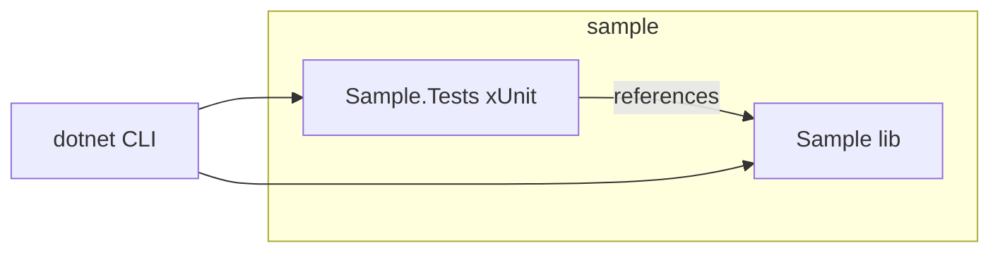
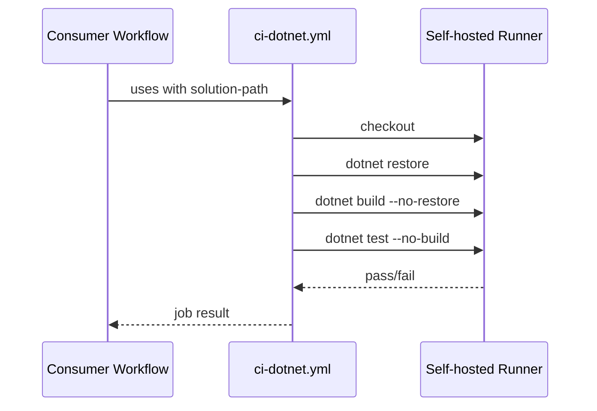
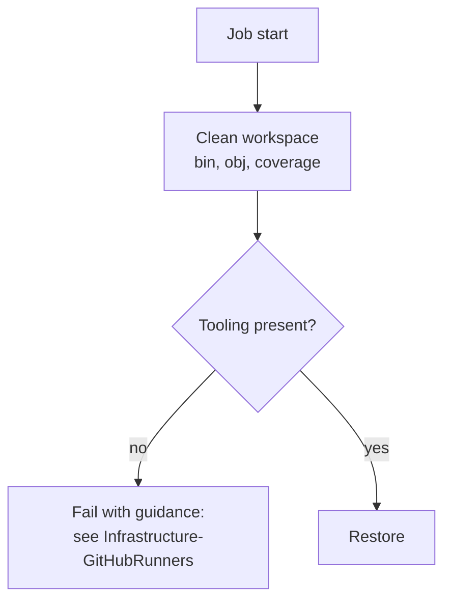
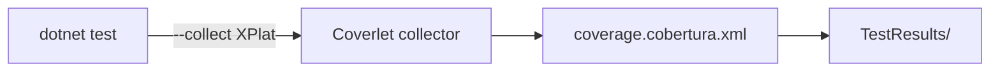
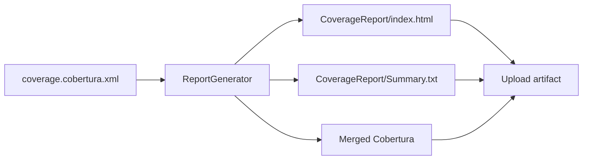
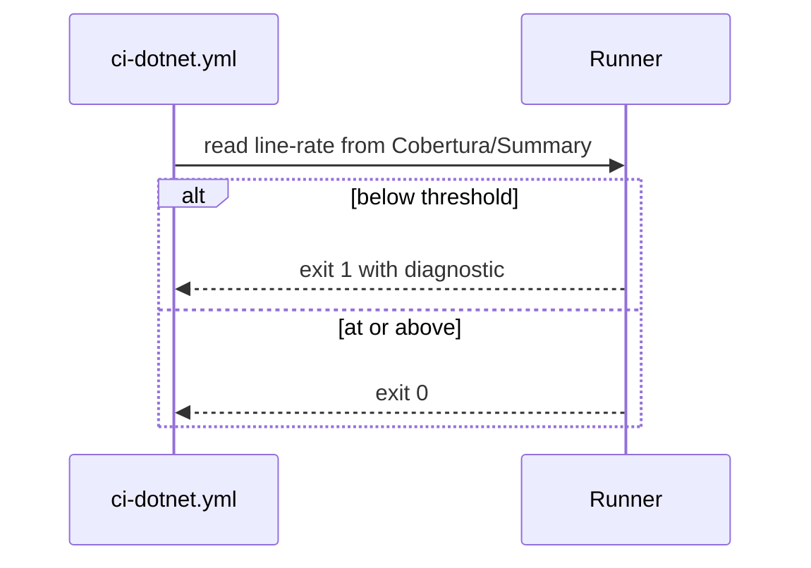
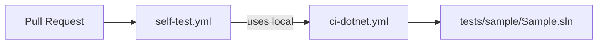
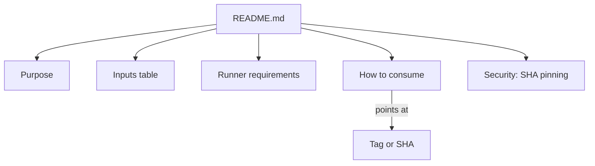
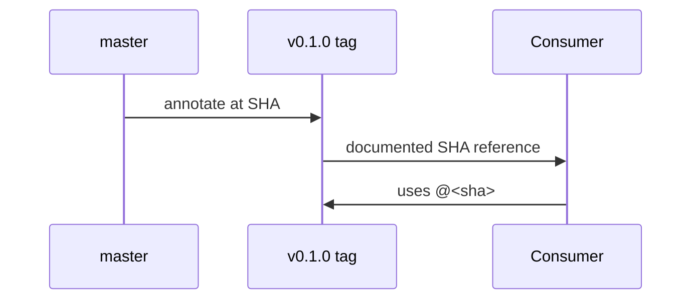
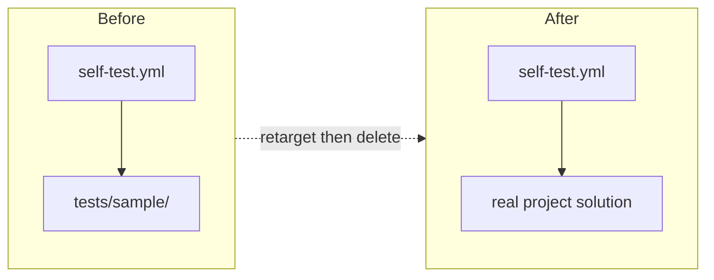

# Plan - Shared .NET CI and Coverage Analysis

See [problem.md](problem.md) for context, scope, constraints, and done
criteria. Each step below is a single commit. Tests for this repository
mean: the reusable workflow is exercised end-to-end against a minimal
in-repo sample .NET project (the "self-test consumer") that lives under
`tests/sample/`. Until that sample exists, earlier steps are validated by
local `dotnet` invocations of the same commands the workflow runs.

## Index
- [Step 1 - Self-Test Sample Project](#step-1---self-test-sample-project)
- [Step 2 - Minimal ci-dotnet.yml (Restore, Build, Test)](#step-2---minimal-ci-dotnetyml-restore-build-test)
- [Step 3 - Workspace Cleanup and Tooling Assertion](#step-3---workspace-cleanup-and-tooling-assertion)
- [Step 4 - Coverage Collection via Coverlet](#step-4---coverage-collection-via-coverlet)
- [Step 5 - Report Generation and Artifact Upload](#step-5---report-generation-and-artifact-upload)
- [Step 6 - Coverage Threshold Gate](#step-6---coverage-threshold-gate)
- [Step 7 - Self-Test Workflow](#step-7---self-test-workflow)
- [Step 8 - README and SHA-Pinning Guidance](#step-8---readme-and-sha-pinning-guidance)
- [Step 9 - Initial Tagged Release](#step-9---initial-tagged-release)
- [Step 10 - Decommission Self-Test Sample](#step-10---decommission-self-test-sample)

---

## Step 1 - Self-Test Sample Project

**Reason:** The workflow needs something to build, test, and measure
coverage on. A tiny in-repo sample (`tests/sample/`) gives that without
pulling an external consumer into the loop, and becomes the harness for
every subsequent step.

**Changes:**
- `tests/sample/Sample.sln`
- `tests/sample/src/Sample/Sample.csproj` (one library, one trivially
  testable class)
- `tests/sample/tests/Sample.Tests/Sample.Tests.csproj` (xUnit) with one
  passing test that exercises the library
- TFM matches the lowest version SynergyOps repos will target

**Tests:**
- `dotnet build tests/sample/Sample.sln` succeeds
- `dotnet test tests/sample/Sample.sln` runs one test, passes

---

## Step 2 - Minimal ci-dotnet.yml (Restore, Build, Test)

**Reason:** Land the smallest possible reusable workflow first so the
shape and inputs are reviewed before coverage complexity is added.

**Changes:**
- `.github/workflows/ci-dotnet.yml` with `on: workflow_call`
- Inputs: `solution-path` (required), `runs-on-label` (default
  `self-hosted`)
- Steps: checkout, `dotnet restore`, `dotnet build --no-restore`,
  `dotnet test --no-build`
- Job `runs-on: [self-hosted, "${{ inputs.runs-on-label }}"]`

**Tests:**
- YAML validates via `actionlint` (or `yamllint` as a fallback) locally
- The same `dotnet` commands run cleanly against `tests/sample/` from a
  PowerShell shell to mirror the runner environment

---

## Step 3 - Workspace Cleanup and Tooling Assertion

**Reason:** Self-hosted runners persist `_work/`. Without an explicit
cleanup, stale artifacts from prior runs can leak into later steps. And
without a tooling assertion, a missing SDK or ReportGenerator silently
fails halfway through the job; failing fast at the top with a clear
message saves debugging.

**Changes:**
- Pre-step in `ci-dotnet.yml` that removes `bin/`, `obj/`, coverage
  output paths under the workspace
- Assertion step that runs `dotnet --version` and `reportgenerator
  --version` (latter added even though it is only used in Step 5, so the
  failure surface is consistent), failing with a guidance message that
  points at `Infrastructure-GitHubRunners`

**Tests:**
- Local dry-run: seed `tests/sample/src/Sample/bin/` with a junk file,
  run the cleanup commands, confirm removal
- Local run of the assertion commands prints non-empty versions

---

## Step 4 - Coverage Collection via Coverlet

**Reason:** Coverage is the first feature beyond pass/fail that the
shared workflow must enforce. Coverlet's collector form integrates with
`dotnet test` without per-project package edits in consumers.

**Changes:**
- Update `dotnet test` step to pass
  `--collect:"XPlat Code Coverage"` and `--results-directory
  ./TestResults`
- Add `coverlet.collector` PackageReference to
  `tests/sample/tests/Sample.Tests/Sample.Tests.csproj`
- Output expectation documented: `TestResults/<guid>/coverage.cobertura.xml`

**Tests:**
- Local `dotnet test ... --collect:"XPlat Code Coverage"` against the
  sample produces a `coverage.cobertura.xml` under `TestResults/`
- The file contains line-rate > 0 for the `Sample` assembly

---

## Step 5 - Report Generation and Artifact Upload

**Reason:** A raw Cobertura file is unreadable to humans. ReportGenerator
turns it into HTML and a summary. Uploading both keeps a paper trail per
PR without coupling the workflow to an external coverage service.

**Changes:**
- New step: `reportgenerator -reports:TestResults/**/coverage.cobertura.xml
  -targetdir:CoverageReport -reporttypes:"Html;TextSummary;Cobertura"`
- New step: `actions/upload-artifact` for `CoverageReport/` and the
  merged Cobertura file
- ReportGenerator assumed present (asserted in Step 3); if absent, the
  job fails there with guidance rather than here

**Tests:**
- Local invocation of `reportgenerator` against the artifact from Step 4
  produces `CoverageReport/index.html` and `Summary.txt`
- `Summary.txt` includes a `Line coverage:` line

---

## Step 6 - Coverage Threshold Gate

**Reason:** Coverage that no one enforces drifts down over time. The
threshold has to be an input so consumers can override it without forking
the workflow.

**Changes:**
- New input: `coverage-threshold` (number, default `90`)
- New step parses `CoverageReport/Summary.txt` (or reads the merged
  Cobertura's `line-rate`) and exits non-zero if below the threshold
- Error message names the actual value and the configured threshold

**Tests:**
- Sample is designed to be near 100%; default threshold passes
- Local test: force the threshold to `200` via env override, confirm the
  step fails with the expected message
- Local test: force to `0`, confirm it passes

---

## Step 7 - Self-Test Workflow

**Reason:** The reusable workflow must be exercised on every PR to this
repo, otherwise regressions land unnoticed. A thin wrapper workflow in
this repo that calls `ci-dotnet.yml` against `tests/sample/` provides
that.

**Changes:**
- `.github/workflows/self-test.yml` triggered on `push` and
  `pull_request`
- Calls `./.github/workflows/ci-dotnet.yml` via `uses:` with
  `solution-path: tests/sample/Sample.sln`
- Branch protection updated (manual, documented in README) to require
  this check

**Tests:**
- Push a branch; the self-test workflow runs and goes green on a
  self-hosted runner
- Temporarily break the sample test, confirm the workflow goes red,
  revert

---

## Step 8 - README and SHA-Pinning Guidance

**Reason:** Without explicit documentation, consumers will pin by branch
(or worse, by `@master`), and the SHA-pinning constraint from the problem
statement is lost. README is the only place consumers will look.

**Changes:**
- `README.md` sections: Purpose, Inputs (table), Secrets,
  Runner Requirements (link to `Infrastructure-GitHubRunners`), How To
  Consume (code block with `uses: org/DotNet-Common/.github/workflows/ci-dotnet.yml@<sha>`),
  Security Notes (SHA pinning rationale), Versioning
- Update root index sections of any sibling MD files (none yet)

**Tests:**
- Markdown renders cleanly (no broken anchors); checked via local
  preview
- All links in the README resolve (relative ones to local files; absolute
  ones to sibling repos verified by path existence under `c:\a_Code\`)

---

## Step 9 - Initial Tagged Release

**Reason:** Consumers need a concrete reference to pin to. A tag (and the
SHA it points at) makes the contract explicit and lets future breaking
changes be released as a new tag without surprising existing consumers.

**Changes:**
- Annotated tag `v0.1.0` on the head of `master`
- Push tag to remote
- Update README "How To Consume" example to use the new SHA (the tag's
  commit SHA, not the tag name, in the example)

**Tests:**
- `git show v0.1.0` resolves
- A scratch consumer workflow (run once locally or in
  SynergyOps.TaskManager off a throwaway branch) using the pinned SHA
  goes green end-to-end on a self-hosted runner

---

## Step 10 - Decommission Self-Test Sample

**Reason:** `tests/sample/` exists only to give the reusable workflow
something to run against while the repo has no real code. Once this repo
is populated with genuine .NET code (shared MSBuild props, analyzers, a
base test SDK, or similar), that code becomes the natural self-test
target and the sample is dead weight that drifts out of date.

**Precondition (gate this step on):**
- At least one non-sample .NET project lives in this repo (with its own
  tests) that exercises `ci-dotnet.yml` end-to-end.
- `self-test.yml` has been retargeted to that real project's solution
  (separate commit, lands before this one).

**Changes:**
- Delete `tests/sample/`
- Remove any sample-specific references from `README.md`
- Confirm `.gitignore` entries that were sample-specific (none expected)
  are pruned

**Tests:**
- `self-test.yml` still goes green on a self-hosted runner against the
  real project's solution
- `git grep tests/sample` returns no matches
- A consumer pinned to the prior SHA continues to work (the removal is
  not a breaking change to the workflow contract; it only changes what
  this repo self-tests against)

---

## Cross-Cutting Notes
- Repo bootstrap (`git init`, `.gitignore`, `README.md` skeleton) is a
  prerequisite handled outside this plan; the plan assumes a tracked
  working tree from the first step.
- After every step that affects user-visible behavior, update
  `README.md` (created in Step 8; before then, defer user-facing
  documentation bullets).
- After every step: `git status` clean, `dotnet build` and `dotnet test`
  green against `tests/sample/`, and (from Step 2 onward) the workflow
  YAML is `actionlint`-clean.
- If during execution something outside this plan is requested, append
  it as a new step here before acting.
